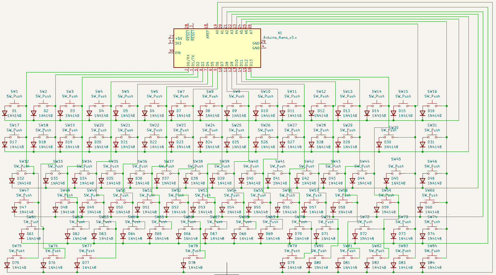
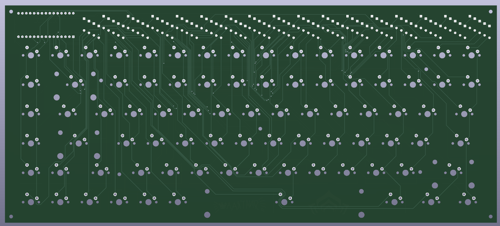

# Zavrsni rad Mehanicka tipkovnica s arduinom

<h3>Shema</h3>

Shema tipkovnicje korisit matriks koji gleda koja je tipka pritisnuta u bilo kojem vrenu te ta se informacija šalje arduinu te on računalu šalje podatak koja je tipka pritisnuta i što bi on trebao ispisati.

<h3>PCB</h3> 

Napravio sam PCB-u besplatnom programu KiCad 7.0, a izradu PCB-a je odradio JLCPCB.

